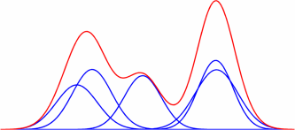

# Problem Set

~~~
(define get-phone-mean (mem (lambda (phone)  (gaussian 0.0 1.0) )))
(define get-phone-variance (mem (lambda (phone)  1.0)))

(define (sample-phone)
  (DPmem 1.0 gensym))

(define sample-morpheme
  (DPmem 1.0
         (lambda ()
           (map (lambda (phone)
                  (gaussian (get-phone-mean phone)
                            (get-phone-variance phone)))
                  (repeat (poisson 5.0) sample-phone)))))

(sample-morpheme)
~~~

# Using Metropolis Hastings

Metropolis Hastings is a general method for defining a Markov chain
whose stationary distribution is some target distribution $$p(x)$$
using some *proposal distribution* $$q(x \rightarrow x')$$ defining a
transition on the support of $$p$$. We can use any proposal
distribution we like, so long as it is reaches the entire support of
$$p(x)$$. Note that we only need to be able to compute $$p(x)$$ up to
a normalizing constant. That is, we don't need to be able to sample
from it, only to evaluate it (up to a constant) at any state $$x$$. By
contrast, the proposal distribution $$q(x \rightarrow x')$$---sometimes
written $$q(x'|x)$$---needs to be sampleable.

Metropolis-Hastings works in two steps. First, we draw a new state
$$x'$$ from $$q(x'|x)$$ then this is state is either *accepted* with
probability $$A(x \rightarrow x')=\min\left(1,
\frac{p(x')q(x'\rightarrow x)}{p(x)q(x\rightarrow x')}\right)$$,
otherwise it is *rejected* and we remain in state $$x$$. Crucially, to
use Metropolis-Hastings we must be able to compute $$A(x \rightarrow
x')$$ which includes not only the *proposal probability*
$$q(x\rightarrow x')$$ but also the *reverse probability*
$$q(x'\rightarrow x)$$. In practice, this latter quantity can
sometimes be quite hard to compute since it must include every
possible path from $$x' \rightarrow x$$ under the proposal
distribution $$q$$.

Let's assume we have a sequence of correlated observations drawn from
a two-dimensional Gaussian distribution. $$x_i, y_i | \rho \sim
\mathrm{GAUSS}(\mu, \Sigma)$$

# Sampling for the Infinite Gaussian Mixture Model

Now consider a more complex case: inference for a Dirichlet Process
distributed infinite mixture of Gaussians after observing some
datapoints.

Our observations consist of a set of $$N$$ real valued vectors
$$y^{(i)}$$. The latent parameters we need to sample are (i) the
seating arrangement of $$N$$ customers in the Dirichlet process and
the Gaussian parameters associated with each table in the
restaurant. Obviously, there are many different seating arrangements
over $$N$$ customers (actually this number grows like the so-called
[Bell numbers](https://en.wikipedia.org/wiki/Bell_number)). There are
also uncountably (continuously many) possible means and variances
associated with each table. Our goal is to define a proposal
distribution that makes small changes to a particular seating
arrangment and then use Metropolis-Hastings to turn it into a sampler
for the *posterior distribution* over seating arrangements and table
parameters.

The idea we are going to use is that is is possible to reseat just one
customer at a time (i.e., just generate one datapoint at a
time). Because the Dirichlet process is *exchangeable* we can treat
any observation as if it was the most recent observation. So the idea
is (i) choose an observation, (ii) remove it from the restaurant (iii)
sample a table for it as if it was the next observation sampled (iv)
use Metropolis-Hastings to accept or reject the sample.

Note that this proposal makes use of the *posterior predictive*
distribution to sample proposals. In other words, it resamples one
datapoint from the conditional posterior, keeping all of the other
datapoints fixed. This is a very common way to implement an MCMC
algorithm and is a special case of MH known as *Gibbs sampling*. One
advantage of Gibbs sampling is that, because you are sampling from a
(partial) posterior, you always accept according to the MH
criterion. To see this note that (unnormalized) probability of
observing $$N$$ values with some seating arrangement and table labels is: 

$$\frac{1}{1+\alpha} p(y^{(1)} | \mu_{z_1}, \sigma^{2}_{z_1})
p(\mu_{z_1}, \sigma^{2}_{z_1}) \times ... \times \frac{n_{z_{(N-1)}}}{1+\alpha} p(y^{(N-1)} | \mu_{z_{(N-1)}}, \sigma^{2}_{z_{(N-1)}})$$

The posterior probability if this state is just this value divided by
a constant $$C$$. So our target distribution, the posterior, is just
proportional to the prior. Our proposal distribution is also just the
posterior predictive, and our reverse probability is just given by the
possibility that we resample the *same table* as before in the
restaurant. Thus, all the terms in the MH criteria cancel and equal $$1$$.

add_observation(obs_id, obs_value, table)
remove_observation(obs_id)
posterior_predictive(obs_value, table)
score()

<!--
The probability of a particular CRP partition can also be written down
in closed form as follows.
$$P(\vec{y})=\frac{\alpha^{K}\Gamma[\alpha]\prod_{j=0}^{K}\Gamma[y_{j}]}{\Gamma[\alpha+\sum_{j=0}^{K}y_{j}]}$$
Where $$\vec{y}$$ is the vector of counts of customers at each table and
$$\Gamma(\cdot)$$ is the gamma function, a continuous generalization of
the factorial function. This shows that for a CRP the vector of counts
is sufficient.
-->

